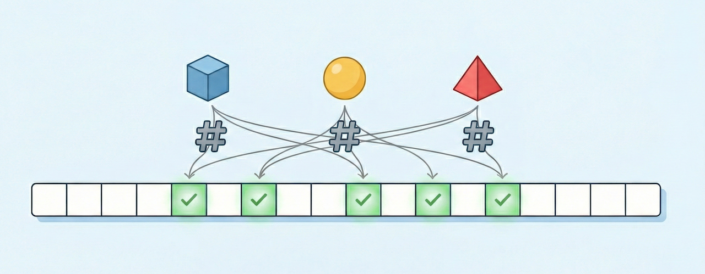

# Bloom Filter

A high-performance, memory-efficient Bloom Filter implementation in Rust.  
Get directly from [crates.io](https://crates.io/crates/bloomlib).

See `bloomsrv` at [github.com](https://github.com/wkusnierczyk/bloomserv) and [crates.io](https://crates.io/crates/bloomsrv) for `bloomlib` wrapped into a REST API, providing a language-agnostic service allowing users to create and query multiple bloom filters   

## What is a Bloom Filter?



A **Bloom Filter** is a space-efficient probabilistic data structure used to test whether an item is a member of a set.
It is designed to rapidly and memory-efficiently check whether an item is **definitely not in** the set or
**possibly in** the set.
A Bloom filter _cannot_ check whether an item **certainly is** in the set.

### The Problem it Solves

When checking for membership in massive datasets (e.g., is a username is taken, is a URL is malicious, or checking a
cache), keeping every item in a standard hash table (dictionary) or database index consumes a massive amount of storage
space (RAM, disk).

A Bloom Filter solves this by sacrificing 100% accuracy for massive space savings. It uses a bit array and hash
functions to represent the set.

Note that:

* **False Positives** (FPs) are _possible_: the filter may say that an item possibly is in the set while the item isn't
  there.

* **False Negatives** (FNs) are _impossible_: the filter may say that an item is not in the set only if the item indeed
  is not there.

## Implementation Details

This implementation provides the Bloom Filter as a rust library, `bloomlib`.
It focuses on two main optimizations:

1. **Memory efficiency**:
   Instead of `Vec<bool>` (a vector of booleans, which takes 1 byte per bit) or `Vec<usize>`, it uses a `Vec<u64>`
   (a vector of 64-bit unsigned integers).
   This ensures exactly 1 bit is used per flag, maximizing cache locality and minimizing heap usage.

2. **Computational efficiency**:
   The implementation uses the Kirsch-Mitzenmacher Optimization (double hashing).
   A standard Bloom Filter requires $k$ distinct hash functions, which is computationally expensive. This implementation
   uses double hashing to simulate $k$ hash functions performing only two actual 64-bit hash computations ($h_1$
   and $h_2$).
   The $i$-th hash value is then calculated as:

   $$ g_i(x) = (h_1(x) + i \cdot h_2(x)) \mod m $$

   where $m$ is the number of flags. This provides similar collision properties to independent hash functions but is
   significantly faster to compute.

## Usage

Import the struct `BloomFilter` from the `bloomlib` library:

```rust
use bloomlib::BloomFilter;
```

Below is an example of using the Bloom filter.
Note that `BloomFilter` may be initialized _either_ with the number of hash functions (with the double hashing
optimization, see above), provided as an integer value, _or_ with th desired FP rate, provided as a floating point
value.

```rust
fn main() {
    // 1a. Initialize with expected item count and false positive rate
    let mut filter = BloomFilter::new(100_000, 0.01);

    // 1b. Initialize with expected item count and hash count
    // let mut filter = BloomFilter::new(100_000, 7u32);

    // 2. Insert items
    filter.insert("seen");
    filter.insert("seen as well");

    // 3. Check for existence
    if filter.contains("seen") {
        println!("Item probably seen.");
    }

    if !filter.contains("never seen") {
        println!("Item never seen.");
    }
}
```

## Configuration

The `BloomFilter::new` constructor is flexible and accepts either:

1. **False positive rate, `f64`**: The library calculates the optimal number of bits ($m$) and hashes ($k$) to match
   this rate.
2. **Hash count, `u32`**: The library calculates the optimal number of bits ($m$) to satisfy the standard 50% fill-rate
   assumption for the given $k$, where the theoretical false positive rate is $\approx 2^{-k}$.


## Limitations

* **Memory addressing and system architecture**:
  The maximum size of the filter is constrained by the architecture's pointer size (`usize`).

    * **64-bit Systems**: The filter can theoretically address up to $2^{64}$ bits (though limited physically by
      available RAM).

    * **32-bit Systems**: The filter is limited to $2^{32}$ bits (approx 512MB to 4GB depending on OS memory limits).

* **Maximum Items**:
  The `expected_items` input is a `usize`. You cannot create a filter for more items than `usize::MAX`.

* **Hash Function Limit**:
  The number of hash functions ($k$) is stored as a `u32`. While this allows for \~4 billion hashes, practically, a very
  high $k$ (caused by requesting an extremely low false positive rate like $10^{-20}$) will severely impact
  performance due to CPU overhead during insertions and lookups.

## Testing

The library includes unit tests for initialization, insertion, persistence, and false positive rates.

```bash
cargo test
```

## Benchmarking

The package includes benchmarking code to measure memory footprint, insertion speed, and lookup speed.

Run the benchmark with the release flag for accurate timing:

```bash
cargo run --release --example benchmark
```

Example output:

```bash
---------- Bloom Filter Performance Benchmark -----------

Items                100000000
Target FP Rate       0.0000000000001
Hash Count           44

---------------------------------------------------------

[Memory Usage]
Bit Vector Size       742.71 MB (778786000 bytes)
Bits per item         62.30 bits

[Insertion Performance]
                      593.58 ns/op | 1.68 million ops/sec
[Lookup Performance - Worst Case (Seen Items)]
                      518.95 ns/op | 1.93 million ops/sec
[Lookup Performance - Average Case (Unseen Items)]
                      206.30 ns/op | 4.85 million ops/sec
[Lookup Performance - Best Case (Empty Filter)]
                      43.62 ns/op | 22.93 million ops/sec
```

The performance depends on CPU speed and cache availability. 

**Note**: Lookup of unseen items is faster than insert and lookup of seen items because the filter can return `false` as
soon as it encounters the first `0` bit, whereas insert and lookup of seen items must set or check, respectively, all
$k$ bits.

## Contributions

Please feel free to open an issue or submit a pull request.
